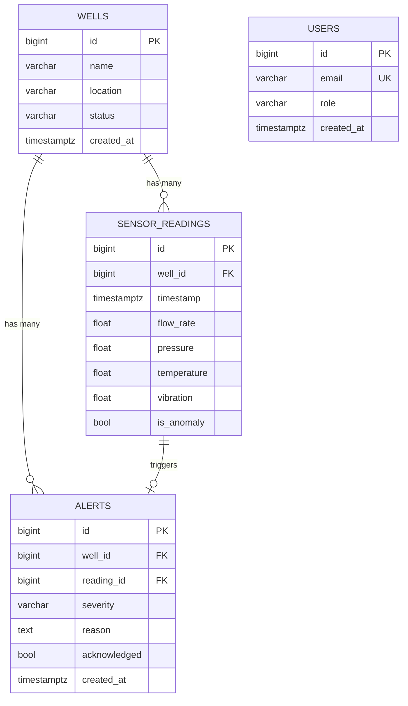

# PetroSense — Database Schema

PostgreSQL (database `petrosense_django`), managed by Django migrations in
`core/migrations/`. Four tables sit at the heart of the product; the
relationships are what let an **alert point back to the exact reading that
caused it**.

Migrations:

| File | What it does |
|------|--------------|
| `0001_initial.py` | Creates the custom `User` table (`core_user`). |
| `0002_well_sensorreading_alert_and_more.py` | Creates `Well`, `SensorReading`, `Alert` + indexes. |
| `0003_alter_user_email.py` | Makes `User.email` **UNIQUE** (email is the login identifier). |

---

## The four tables

Physical Django table names are prefixed with the app label (`core_`). The
logical names from the brief map as shown.

### 1. `users`  →  `core_user`

Built on Django's `AbstractUser`, so it keeps the columns Django auth needs and
adds `role`. Logical ↔ physical mapping:

| Brief field | Physical column | Notes |
|-------------|-----------------|-------|
| `id` | `id` (BigAuto PK) | |
| `name` | `first_name` | surfaced as `name` by the API serializer |
| `email` **UNIQUE** | `email` | unique index (login identifier) |
| `password` (hashed) | `password` | PBKDF2 hash via `set_password` |
| `role` `['admin','engineer']` | `role` | default `engineer` |
| `created_at` | `date_joined` | AbstractUser's creation timestamp |

Plus Django auth columns: `username` (unique), `is_staff`, `is_active`,
`is_superuser`, `last_login`, group/permission M2M.

### 2. `wells`  →  `core_well`

| Column | Type | Notes |
|--------|------|-------|
| `id` | bigint PK | |
| `name` | varchar(120) | |
| `location` | varchar(255) | |
| `status` | varchar(20) | `['normal','warning','critical']`, default `normal` |
| `created_at` | timestamptz | `auto_now_add` |

### 3. `sensor_readings`  →  `core_sensorreading`

| Column | Type | Notes |
|--------|------|-------|
| `id` | bigint PK | |
| `well_id` | bigint FK → `wells.id` | `ON DELETE CASCADE` |
| `timestamp` | timestamptz | |
| `flow_rate` | double precision | m³/day |
| `pressure` | double precision | bar |
| `temperature` | double precision | °C |
| `vibration` | double precision | mm/s |
| `is_anomaly` | boolean | default `false` |

### 4. `alerts`  →  `core_alert`

| Column | Type | Notes |
|--------|------|-------|
| `id` | bigint PK | |
| `well_id` | bigint FK → `wells.id` | `ON DELETE CASCADE` |
| `reading_id` | bigint FK → `sensor_readings.id` | `ON DELETE CASCADE` |
| `severity` | varchar(20) | `['normal','warning','critical']` |
| `reason` | text | human-readable explanation |
| `acknowledged` | boolean | default `false` |
| `created_at` | timestamptz | `auto_now_add` |

---

## ER description (in words)

- **One `Well` has many `SensorReadings`** — `sensor_readings.well_id` → `wells.id`.
  Every reading belongs to exactly one well; deleting a well cascades to its
  readings.
- **One `Well` has many `Alerts`** — `alerts.well_id` → `wells.id`. A convenience
  link so a well's alerts can be listed directly.
- **Each `Alert` references exactly one `SensorReading`** — `alerts.reading_id` →
  `sensor_readings.id`. This is the key relationship: an alert always points back
  to the precise reading whose values triggered it, so the UI can show
  "reading vs baseline" for that exact moment.
- `Users` stands alone (no FK to the domain tables in this stage); it drives
  authentication and role-based access control.

Deletion rules: all three FKs are `ON DELETE CASCADE`, so removing a well cleanly
removes its readings and alerts, and removing a reading removes any alert built
from it — no orphaned rows.

---

## Indexes and why each exists

| Table | Index | Columns | Why |
|-------|-------|---------|-----|
| `sensor_readings` | `core_sensor_well_id_..._idx` | `(well_id, timestamp DESC)` | The hot query: **"latest N readings for one well"** (`/api/wells/{id}/readings/?limit=100`) and the live charts. A composite on `well_id` then `timestamp DESC` lets Postgres seek to the well and read the most-recent rows in index order — no filesort. Its left-most prefix (`well_id`) also serves plain "readings for this well" lookups. |
| `sensor_readings` | `core_sensorreading_well_id_...` | `(well_id)` | Auto-created by Django for the FK. Speeds up joins and cascade deletes from `wells`. |
| `alerts` | `core_alert_severit_..._idx` | `(severity)` | The Alerts screen filters by **severity** (critical / warning / normal). Indexing it keeps that filter fast as alert volume grows. |
| `alerts` | `core_alert_created_..._idx` | `(created_at DESC)` | Alerts are listed **newest-first** (`ordering = ['-created_at']`). A descending index returns them already ordered. |
| `alerts` | `core_alert_well_id_...` | `(well_id)` | Auto FK index — filter alerts by well and support cascade delete. |
| `alerts` | `core_alert_reading_id_...` | `(reading_id)` | Auto FK index — the alert → reading join (showing the exact triggering reading). |
| `users` | `core_user_email_..._uniq` | `(email)` UNIQUE | Enforces one account per email **and** makes email login (`filter(email=…)`) an index lookup. |

The brief asked for indexes on **well_id, timestamp, severity** — all covered:
`well_id` + `timestamp` by the composite on `sensor_readings` (plus the FK
indexes), and `severity` by the dedicated alerts index.
